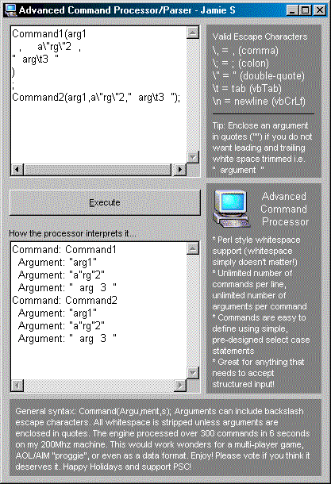



## Advanced Command Processor/Parser \- basis for a compiler

### Description

* Perl style whitespace

support (whitespace

simply doesn't matter!)

* Unlimited number of

commands per line,

unlimited number of

arguments per command

* Commands are easy to

define using simple,

pre-designed select case

statements

* Great for anything that

needs to accept

structured input!

General syntax: Command(Argu,ment,s); Arguments can include backslash escape characters. All whitespace is stripped unless arguments are enclosed in quotes. The engine processed over 300 commands in 6 seconds on my 200Mhz machine. This would work wonders for a multi-player game,

AOL/AIM "proggie", or even as a data format. Enjoy! Please vote if you think it deserves it. Happy Holidays and support PSC!
 
### More Info
 
see code

             |
---                |---
**Submitted On**   |2000-12-03 13:28:50
**By**             |[Jameson Schriber](https://github.com/Planet-Source-Code/PSCIndex/blob/master/ByAuthor/jameson-schriber.md)
**Level**          |Advanced
**User Rating**    |4.8 (163 globes from 34 users)
**Compatibility**  |VB 6\.0
**Category**       |[Complete Applications](https://github.com/Planet-Source-Code/PSCIndex/blob/master/ByCategory/complete-applications__1-27.md)
**World**          |[Visual Basic](https://github.com/Planet-Source-Code/PSCIndex/blob/master/ByWorld/visual-basic.md)
**Archive File**   |[CODE\_UPLOAD122941232000\.zip](https://github.com/Planet-Source-Code/jameson-schriber-advanced-command-processor-parser-basis-for-a-compiler__1-13290/archive/master.zip)

